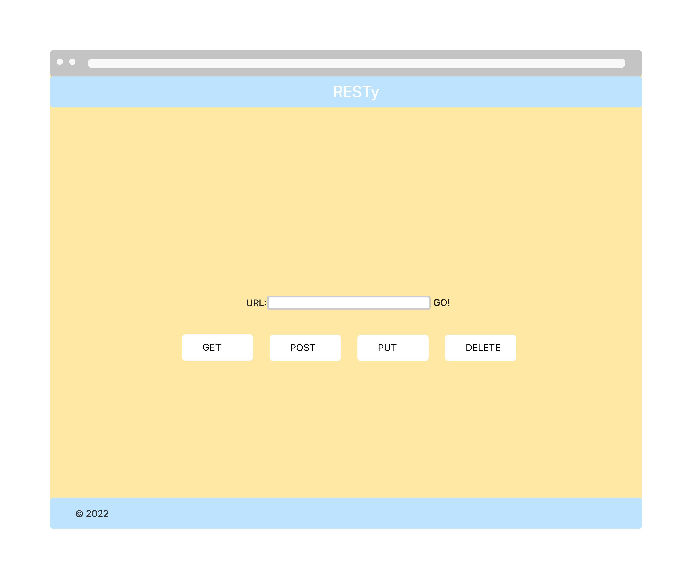

# RESTy

A browser based API testing tool

## Author: Tyler Main

## References and Credits

Referenced starter code and worked alongside Luis Rosales and also had help from Stephanie Hill and Stephen Martinez.

## Business Requirements

Our application will be an API testing tool that can be run in any browser, allowing a user to easily interact with APIs in a familiar interface.

## Phase 1 Requirements

Today, we begin the first of a 4-Phase build of the RESTy application, written in React. In this first phase, our goal is to setup the basic scaffolding of the application, with intent being to add more functionality to the system as we go. This initial build sets up the file structure so that we can progressively build this application in a scalable manner

## Phase 2 Requirements

In phase 2, we will be receiving user input in preparation of connecting to live APIs, using the useState() hook in our functional components. In order to properly manage state with the useState hook, we will now convert App.js to a functional component.

The following user stories detail the major functionality for this phase of the project.

- As a user, I want to enter the REST Method and URL to an API
- As a user, I want to see a summary of my request as well as results returned from an API request in my browser in a readable format

### Application Flow:

- User enters an API URL
- Chooses a REST Method
- Clicks the “Go” button
- Application fetches data from the URL given, with the method specified
- Displays the response headers and results separately
- Both headers and results should be “pretty printed” JSON

## Lab 26

Refactored all of the child components of App.js from classes to functions. Use .scss pages to style the webpage.

## Lab 27

Refactored any components using this.setState to implement the useState react API hook.

Refactored the Form Component to implement user input from form elements, instead of hard coded string values.

### Wireframe Lab 26

### UML Lab 27

